# Análisis y Modelado: Predicción de Precios de Casas 🏠

# Descripción del Proyecto 💡

Este proyecto tiene como objetivo desarrollar un modelo predictivo capaz de estimar el precio de propiedades inmobiliarias en Madrid, utilizando un conjunto de datos real con 40 columnas. Estas columnas incluyen información clave sobre las propiedades, como su tamaño, ubicación, número de habitaciones, tipo de propiedad y más. 

El propósito principal es ofrecer una herramienta útil para agentes inmobiliarios, compradores y vendedores, que permita tomar decisiones más informadas basadas en datos.

## 🎯 Objetivo
1. **Carga y Exploración de Datos**:
   - Identificar patrones en los datos.
   - Detectar valores atípicos y posibles inconsistencias.

2. **Preprocesamiento**:
   - Limpieza y preparación de datos.
   - Codificación de variables categóricas.
   - Escalado de variables numéricas.
   - Gestión de valores nulos y outliers.

3. **Modelado**:
   - Entrenamiento de múltiples modelos de Machine Learning.
   - Evaluación de su desempeño utilizando métricas como RMSE y R².

4. **Visualización**:
   - Mostrar gráficamente la importancia de las variables.
   - Analizar los errores y predicciones del modelo.

5. **Optimización**:
   - Ajustar hiperparámetros para maximizar la precisión del modelo.

## Estructura del Proyecto 🗂️

```bash
Proyecto7-PrediccionCasas/
├── datos/                      # Archivos de datos CSV y PKL para el proyecto.
│   ├── lista_opciones/         # Lista de opciones para los menús de streamlit.
│   ├── modelos-encoders/       # Lista de PKLs de los modelos y encoders ya entrenados.
│
├── jupyter_notebooks/          # Notebooks de Jupyter con los modelos probados.
│   ├── Modelo X/               # Carpeta del modelo
│   │   ├── 00_Sobre_El_Modelo.md
│   │   ├── 01_eda_inicial.ipynb
│   │   ├── 02_gestion_nulos.ipynb
│   │   ├── 03_eda_sin_nulos.ipynb
│   │   ├── 04_encoding.ipynb
│   │   ├── 05_feature_scaling.ipynb
│   │   ├── 06_gestion_outliers.ipynb
│   │   ├── 07_regresion_lineal.ipynb
│   │   ├── 08_decision_tree.ipynb
│   │   ├── 09_gradient_boosting.ipynb
│   │   ├── 10_XGBoost.ipynb
│ 
├── src/                        # Archivos .py para funciones auxiliares del proyecto.
│
├── streamlit/                  # Web para realizar predicciones de forma rápida y bonita
│    ├── main.py                # Configuración Web
│    ├── prueba_modelo.ipynb 
│
└── README.md                   # Descripción del proyecto, instrucciones de instalación y uso.
```
# Instalación y Requisitos 🛠️

## Requisitos

Para ejecutar este proyecto, asegúrate de tener instalado lo siguiente:

- **Python 3.x** 🐍
- **Jupyter Notebook** 📓 para ejecutar y visualizar los análisis de datos
- **Bibliotecas de Python**:
    - [pandas](https://pandas.pydata.org/docs/) para manipulación y análisis de datos 🧹
    - [numpy](https://numpy.org/doc/stable/) para cálculos numéricos y manejo de matrices 🔢
    - [matplotlib](https://matplotlib.org/stable/index.html) para crear gráficos básicos 📊
    - [seaborn](https://seaborn.pydata.org/) para visualizaciones estadísticas avanzadas 📈
    - [tqdm](https://tqdm.github.io/) para mostrar barras de progreso en procesos largos ⏳
    - [xgboost](https://xgboost.readthedocs.io/) para la implementación de modelos basados en Gradient Boosting 🌟
    - [scikit-learn](https://scikit-learn.org/stable/) para modelado predictivo y preprocesamiento, incluyendo:
        - `LinearRegression`, `DecisionTreeRegressor`, `RandomForestRegressor`, `GradientBoostingRegressor`, y `XGBRegressor` para tareas de regresión
        - `train_test_split`, `GridSearchCV`, `KFold`, `LeaveOneOut` y `cross_val_score` para partición de datos y validación de modelos
        - `StandardScaler` para el escalado de variables
        - Métricas como `r2_score`, `mean_squared_error`, `mean_absolute_error` para evaluar los modelos
    - [pickle](https://docs.python.org/3/library/pickle.html) para serializar y cargar modelos y objetos 🛠️

## Configuración Adicional

- Configura `pd.options.display.float_format` para un formato más claro en los valores flotantes.
- Añade rutas personalizadas al sistema usando `sys.path.append` para facilitar el acceso a los módulos personalizados del proyecto.

## Instalación 🛠️

1. Clona este repositorio para visualizarlo en vscode:
```bash
git clone https://github.com/apelsito/Proyecto7-PrediccionCasas.git
cd Proyecto7-PrediccionCasas
```
# Resumen del Proyecto: Predicción de Precios de Casas 🏠

## Fase 1: Análisis Exploratorio Inicial (EDA) 🔍

### Pasos:
1. **Carga de Librerías y Configuración**:
   - Importación de librerías para análisis (pandas, numpy) y visualización (matplotlib, seaborn).
   - Configuración para visualizar más columnas en los DataFrames.

2. **Exploración de Datos**:
   - Carga inicial del dataset.
   - Exploración de estadísticas descriptivas para identificar variables relevantes y anomalías.

3. **Visualización Inicial**:
   - Gráficos de distribución y correlaciones para observar relaciones entre variables y patrones.

### Observaciones 📌
- Se detectaron algunas columnas con posibles valores atípicos.
- Algunas variables tenían nombres poco descriptivos, lo que requerirá limpieza futura.

---

## Fase 2: Gestión de Valores Nulos 🧹

### Pasos:
1. **Identificación de Valores Nulos**:
   - Revisión de las columnas con valores nulos y su porcentaje sobre el total.
   
2. **Imputación de Nulos**:
   - Uso de estrategias avanzadas como `SimpleImputer`, `IterativeImputer` y `KNNImputer`.
   - Validación de las imputaciones comparando estadísticas antes y después.

### Observaciones 📌
- Las columnas `price`, `size`, y `rooms` fueron tratadas con imputaciones adecuadas basadas en distribuciones observadas.
- Algunas imputaciones requerirán validación adicional en la siguiente fase.

---

## Fase 3: EDA Sin Valores Nulos 🔍

### Pasos:
1. **Reanálisis de las Variables**:
   - Exploración de estadísticas descriptivas post-imputación.
   
2. **Visualización**:
   - Gráficos para observar cómo se ajustaron las distribuciones tras el manejo de nulos.

### Observaciones 📌
- La imputación de nulos corrigió varios valores extremos, mejorando las distribuciones de las variables.

---

## Fase 4: Codificación de Variables (Encoding) 🧮

### Pasos:
1. **Identificación de Variables Categóricas**:
   - Clasificación de las columnas categóricas según el tipo de codificación requerida (OneHot, Target, Ordinal).

2. **Aplicación de Codificaciones**:
   - Uso de `OneHotEncoder` para variables con muchas categorías.
   - Aplicación de `TargetEncoder` para las que presentaban relación con la variable respuesta.

### Observaciones 📌
- La codificación de variables categóricas aumentó la dimensionalidad, pero mejorará el modelado.

---

## Fase 5: Escalado de Características (Feature Scaling) 📏

### Pasos:
1. **Selección de Variables Numéricas**:
   - Filtrado de columnas numéricas para el escalado.

2. **Aplicación de Escaladores**:
   - Uso de `StandardScaler`, `MinMaxScaler` y `RobustScaler` según las características de los datos.

### Observaciones 📌
- El escalado uniformizó los valores, facilitando el entrenamiento de modelos de regresión.

---

## Fase 6: Gestión de Outliers 🚫

### Pasos:
1. **Identificación de Outliers**:
   - Uso de métodos como IQR, Local Outlier Factor e Isolation Forest para detectar valores atípicos.

2. **Tratamiento de Outliers**:
   - Imputación o eliminación según su impacto en las distribuciones y relaciones.

### Observaciones 📌
- La eliminación de outliers mejoró significativamente la calidad del dataset.

---

## Fase 7: Regresión Lineal 📈

### Pasos:
1. **Entrenamiento del Modelo**:
   - División del dataset en conjuntos de entrenamiento y prueba.
   - Ajuste de un modelo de regresión lineal.

2. **Evaluación del Modelo**:
   - Métricas como R², MAE, y RMSE para validar la precisión del modelo.

### Observaciones 📌
- El modelo tuvo un desempeño básico, indicando que las relaciones lineales no capturan toda la complejidad de los datos.

---

## Fase 8: Árboles de Decisión 🌳

### Pasos:
1. **Entrenamiento del Modelo**:
   - Ajuste de un modelo de Árbol de Decisión para capturar relaciones no lineales.

2. **Evaluación del Modelo**:
   - Métricas similares a la regresión lineal, con mejoras significativas en el ajuste.

### Observaciones 📌
- El Árbol de Decisión mostró mayor precisión en comparación con la regresión lineal, pero aún con limitaciones en datos complejos.

---

## Fase 9: Gradient Boosting 🚀

### Pasos:
1. **Implementación de Gradient Boosting**:
   - Uso de `GradientBoostingRegressor` para mejorar la capacidad predictiva del modelo.

2. **Tuning de Hiperparámetros**:
   - Ajuste de hiperparámetros usando `GridSearchCV`.

### Observaciones 📌
- Gradient Boosting superó significativamente a los modelos previos, mostrando menor error de predicción.

---

## Fase 10: XGBoost 🌟

### Pasos:
1. **Entrenamiento de XGBoost**:
   - Uso de `XGBRegressor` para aprovechar la capacidad de manejo de datos complejos y gran volumen.

2. **Optimización del Modelo**:
   - Ajuste de parámetros como `learning_rate`, `max_depth` y `n_estimators`.

### Observaciones 📌
- XGBoost fue el modelo más efectivo, con el mejor desempeño en términos de R² y RMSE.

---
# 📊 Historial de Modelos y Resultados 📊
## 1. 📈 Modelo
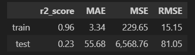

### Observaciones:
- Modelo Inicial

---

## 2. 📉 Modelo 2

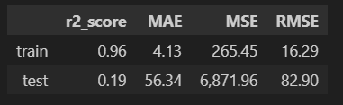

### Observaciones:
- Basado en el **Modelo 1**
- Cambios Respecto Modelo 1:
    - Eliminar columna district
    - Eliminar has3DTour
---

## 3. ⚡ Modelo 3

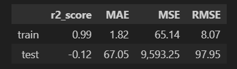

### Observaciones:
- Basado en el **Modelo 2**
- Cambios Respecto Modelo 2:
    - Eliminar hasPlan: No tiene porque afectar al precio
    - Eliminar has360: No tiene porque afectar al precio
    - Eliminar Province: Vamos a predecir sólo de madrid
---

## 4. 💡 Modelo 4

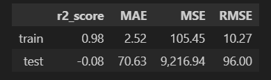

### Observaciones:
- Basado en el **Modelo 3**
- Cambios Respecto Modelo 3:
    - Hemos categorizado los municipios por su clase economica
        - clase alta
        - clase media-alta
        - clase media
        - clase obrera

---

## 5. 🔥 Modelo 5

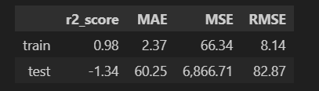

### Observaciones:
- Basado en el **Modelo 4**
- Cambios Respecto Modelo 4:
    - Hemos Eliminado las casas externas a madrid


---

## 6. ⛽ Modelo 6

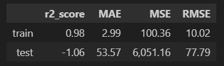

### Observaciones:
- Basado en el **Modelo 5**
- Cambios Respecto Modelo 5:
    - Hemos Eliminado **municipality**: Es probable que este especificando demasiado, y que la distancia al centro defina ya mejor el precio

---

## 7. 💧 Modelo 7

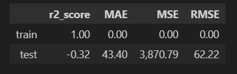

### Observaciones:
- Basado en el **Modelo 1**
- Cambios Respecto Modelo 1:
    - Gestionamos los nulos como en el Modelo 5
    - Eliminar province

## 8. Modelo 8

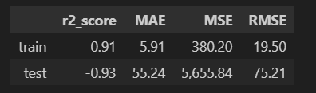

### Observaciones:
- Basado en el **Modelo 7**
- Cambios Respecto Modelo 7:
    - Eliminamos district
    - Eliminamos has3DTour

## 9. Modelo 9

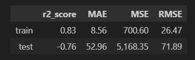

### Observaciones:
- Basado en el **Modelo 8**
- Cambios Respecto Modelo 8:
    - Eliminamos status

## 10. Modelo 10

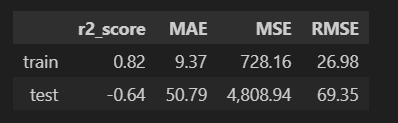

### Observaciones:
- Basado en el **Modelo 9**
- Cambios Respecto Modelo 9:
    - Eliminamos floor

## 11. Modelo 11

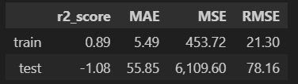

### Observaciones:
- Basado en el **Modelo 9**
- Cambios Respecto Modelo 9:
    - Eliminamos distancia_centro   
## 12. Modelo 12

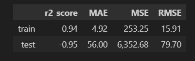

### Observaciones:
- Basado en el **Modelo 11**
- Cambios Respecto Modelo 11:
    - Hemos categorizado los municipios por su clase economica
        - clase alta
        - clase media-alta
        - clase media
        - clase obrera

## 13. Modelo 13

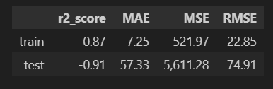

### Observaciones:
- Basado en el **Modelo 12**
- Cambios Respecto Modelo 12:
    - Eliminamos columnas que considero no aportan
        - has360
        - hasPlan

## 14. Modelo 14

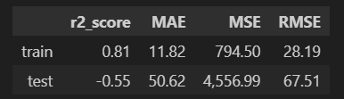

### Observaciones:
- Basado en el **Modelo 13**
- Cambios Respecto Modelo 13:
    - Recategorizamos Floor a:
        - Bajos (Sotano, entreplanta, primero)
        - Altos (Segundos en adelante)
        - Otros (Desconocidos)

## 15. Modelo 15

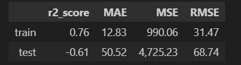

### Observaciones:
- Basado en el **Modelo 14**
- Cambios Respecto Modelo 14:
    - Se restaura la columna "distancia_centro"
    - Se quita la columna "exterior"

## 15. Modelo 16

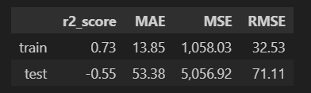

### Observaciones:
- Basado en el **Modelo 15**
- Cambios Respecto Modelo 15:
   - Usando property, se rellenan desconocidos de:
      - hasLift
      - floor
   - Se elimina columna distancia_centro
      - Con la distancia al centro podemos predecir el precio
   - Se elimina propertyType
      - Según los baños y habitaciones + municipality se puede saber que tipo de casa sea

## 15. Modelo 17


### Observaciones:
- Basado en el **Modelo 16**
- Cambios Respecto Modelo 16:
   - Se categoriza size
      - pequeños (0-40m2)
      - medianos (41-100m2)
      - grandes (>100m2)
    

## 15. Modelo 18
### Decision Tree
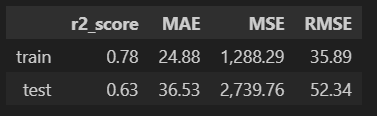
### Gradient Boosting
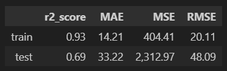
### XGBoost
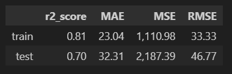
### Observaciones:
- Basado en el **Modelo 1**
- Cambios Respecto Modelo 1:
   - Se eliminan columnas que no aportaban información al modelo para reducir información
      - hasPlan
      - has3DTour
      - has360
      - province
      - exterior
      - status

# Contribuciones 🤝

Las contribuciones a este proyecto son muy bienvenidas. Si tienes alguna sugerencia, mejora o corrección, no dudes en ponerte en contacto o enviar tus ideas.

Cualquier tipo de contribución, ya sea en código, documentación o feedback, será valorada. ¡Gracias por tu ayuda y colaboración!

# Autores y Agradecimientos ✍️

## Autor ✒️
**Gonzalo Ruipérez Ojea** - [@apelsito](https://github.com/apelsito) en github

## Agradecimientos ❤️
Quiero expresar mi agradecimiento a **Hackio** y su equipo por brindarme la capacidad y las herramientas necesarias para realizar este proyecto con solo una semana de formación. Su apoyo ha sido clave para lograr este trabajo.
